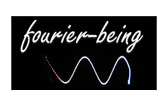
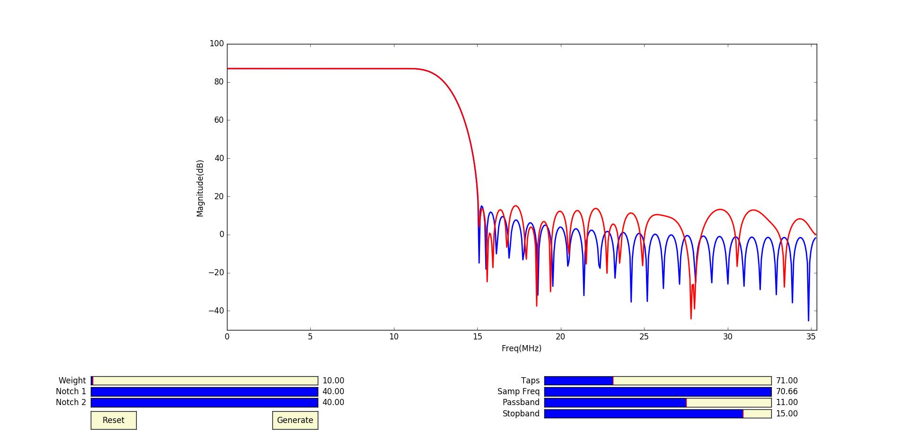

# 

# Least Squared Error Based FIR Filters
> A very flexible graphical interface to design Least Square Error Based FIR Filters and generate fixed point coefficients 
___

## Getting Started
### Install Python on Ubuntu
```
http://askubuntu.com/questions/101591/how-do-i-install-python-2-7-2-on-ubuntu
```
#### NOTE: Follow similar instructions on https://www.python.org/ to get python on windows or macOS
### Get the repositiory
```
username@ubuntu:~$ git clone https://github.com/fourier-being/Least-Squared-Error-Based-FIR-Filters.git
```
### Go to the Repo Directory
```
username@ubuntu:~$ cd Least-Squared-Error-Based-FIR-Filters/
```
### Run the Python script
```
username@ubuntu:~/Least-Squared-Error-Based-FIR-Filters$ python LSDesignAdvanced.py
```
> After running the python script, you should see the following GUI :



#### NOTE: There are sliding bars at the bottom of the plot window corresponding to different parameters. You can adjust the sliding bars according to your requirement and then click on "Generate" button to generate the coefficients.
___

## Description
This tool currently implements only Low-Pass FIR Filter. I am working to add other filters - Bandpass, High Pass and Multiple Band Pass.
Future scope includes a python package which would have all these FIR filters APIs and Coefficients generated using this GUI based tool. Least-Squared Error based FIR Filters basically minimizes the squared error between desired filter response and amplitude response of the FIR filter. I am taking Type-I filter here since it is Low-Pass.

Table showing adjustable parameters and their initial values :

| Parameters    | Initial Value | Unit  |
| ------------- |:-------------:| -----:|
| Num Taps      | 71            |       |
| Sampling Freq | 50.00         |   MHz |
| Passband Freq | 11.00         |   MHz |
| Stopband Freq | 17.00         |   MHz |
| Notch 1 Freq  | 60.00         |   MHz |
| Notch 2 Freq  | 60.00         |   MHz |
| Weight Error  | 100           |       |

#### *NOTE* : Since Type-I FIR filters are implemented therefore Num Taps can take only odd integers which I am converting internally by taking ceiling of the sliding bar value.
___

## License

MIT © [fourier-being]
