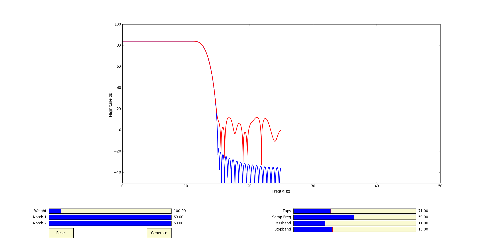

# 

# Least Squared Error Based FIR Filters
> A very flexible graphical interface to design Least Square Error Based FIR Filters and generate fixed point coefficients 

## Getting Started
### Install Python on Ubuntu
```
http://askubuntu.com/questions/101591/how-do-i-install-python-2-7-2-on-ubuntu
```
###NOTE: Follow similar instructions on https://www.python.org/ to get python on windows or macOS
### Get the repositiory
```
username@ubuntu:~$ git clone https://github.com/fourier-being/Least-Squared-Error-Based-FIR-Filters.git
```
### Go to the Repo Directory
```
username@ubuntu:~$ cd Least-Squared-Error-Based-FIR-Filters/
```
### Run the Python script
```
username@ubuntu:~/Least-Squared-Error-Based-FIR-Filters$ python LSDesignAdvanced.py
```
> After running the python script, you should see the following GUI :



#### NOTE: There are sliding bars at the bottom of the plot window corresponding to different parameters. You can adjust the sliding bars according to your requirement and then click on "Generate" button to generate the coefficients.

## Description

## Usage

## Example

